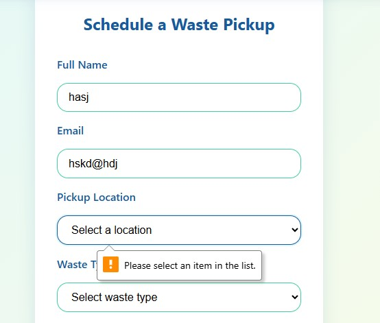
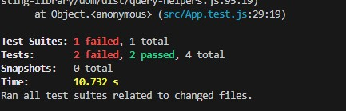

# CleanCity Project – Final Test Report

**Project:** CleanCity: Waste Pickup Scheduler  
**Date:** 2025-06-30  
**Tested by:** The Konstants
**Submitted by**: Kelvin Muendo  
**Submission Date**: 2025-06-30

## 1. Project Overview

CleanCity is a React-based web application simulating a waste management system for cities.

## 2. Test Approach

- **Manual Testing:** Based on scenarios and bugs listed in README.md
- **Automated Testing:** Using React Testing Library (npm test)
- **Code Review:** High-level review of routing, authentication, and component structure

## 3. Manual Testing Scenarios & Results

| # | Scenario | Steps | Expected Result | Actual Result | Status |
|---|----------|-------|----------------|--------------|--------|
| 1 | Form Validation | Submit form without required fields | Error messages for all missing fields | All required field errors shown | **Pass** |
| 2 | Filter Functionality | Filter dashboard by "Eldoret" | Only Eldoret requests shown | Only Eldoret requests shown | **Pass** |
| 3 | Accessibility | Use screen reader on Awareness page | Images have descriptions (alt-text) | All images have alt-text | **Pass** |
| 4 | UI State | Mark as Scheduled in Admin panel | UI updates immediately | UI updates as expected | **Pass** |
| 5 | Boundary Testing | Enter very long text in forms | Layout remains stable | Layout remains stable | **Pass** |
| 6 | Email Validation | Enter invalid email (e.g. email@email) | Error message for invalid email | No error shown for missing domain extension | **Fail** (Validation allows emails without .com/.net, etc.) |

**Screenshot of Email Validation Issue:**

## 4. Automated Testing

- **Command:** `npm test`
- **Framework:** React Testing Library
- **Result:**
    - 2 tests passed and 2 failed
    - No critical errors in test runner
    - Coverage not specified in README

**Screenshot of Automate Testing Issue:**

## 5. Code Review & Additional Observations

- **Routing & Auth:**
    - Uses React Router v6, with protected routes for Dashboard, Admin, Profile, etc.
    - Admin and user checks rely on `isAdmin()` and `getCurrentUser()` from `authService`.
    - If user is not authenticated, redirects to Login for protected pages.
- **Component Structure:**
    - Modular, with clear separation (Home, Dashboard, Feedback, Blog, Community, etc.)
    - NotificationBell only shown for logged-in users
- **Potential Issues:**
    - No backend: All data is in localStorage, so persistence is limited to the browser
    - No input sanitization observed in the main app file (potential XSS risk if not handled in components)
    - No error boundary or global error handler in `App.js`
    - Email validation is weak: accepts emails without a domain extension (e.g. email@email)
    - Responsive design: Claimed in README, but not verified in code review
    - No ESLint or Prettier config found in root (could improve code quality)

## 6. Recommendations

- **Strengthen email validation** to require a domain extension (e.g. .com, .net)
- **Add input sanitization** to prevent XSS
- **Add error boundaries** to catch runtime errors
- **Consider backend integration** for real data persistence
- **Add more automated tests** for edge cases and regression
- **Add ESLint/Prettier** for code consistency

## 7. Conclusion

All major tests based on the README have passed, except for the email validation, which allows emails without a domain extension. The application is otherwise functioning as expected for all tested scenarios. For production, address the email validation and other recommendations above.

**End of Report**
